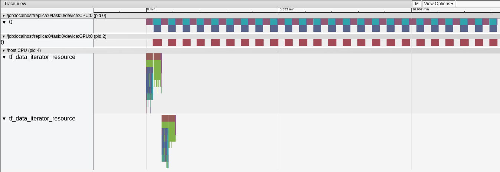
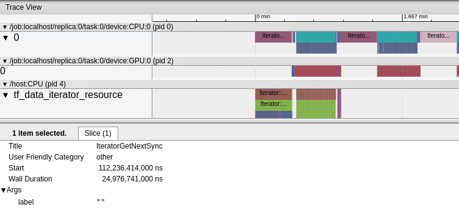
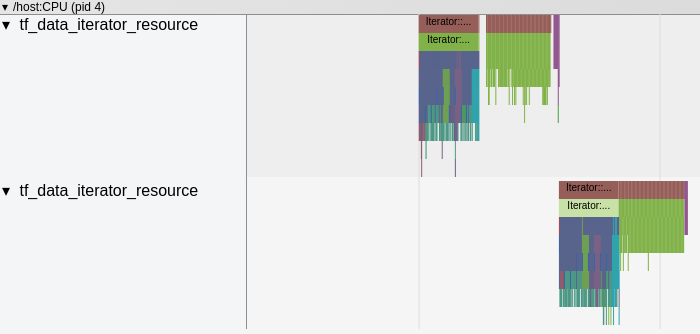
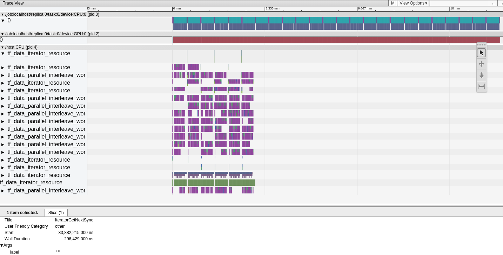

#  Input Pipeline Optimisation for TFRecords 

### Assignment-15

`TFRecords` introduce lazy loading (on demand) loading of the data from dataset. While variety of data can be loaded as `TFRecords`, the commonest form is the data loaded as `.tfrecords` format. 

The text loading operations can be considered roughly the following operations:

1. Extract
2. Transform
3. Load

## Extract

Extract operation typically, encompasses reading from the file system to segregating data as classified columns. In this case, we will read the data as image and class to which the image belongs to. 

#### Normal Loading of TFRecords

The following code is used to load the dataset from a collection of file paths in the `.tfrecords` format.
```python
	dataset = tf.data.TFRecordDataset(path)
```
#### Interleaved Parallel Loading

Here, multiple files are interleaved and can be parallel read by multiple threads. However, the gains may not be substantial for local disk reads and multi-head reads may not be optimised for all the local disks. The effect is much pronounced in SAN or network reads. 

```python
    files = tf.data.Dataset.list_files(path)
    dataset = files.interleave(tf.data.TFRecordDataset,    									                           cycle_length=nfile, 
					           num_parallel_calls=tf.data.experimental.AUTOTUNE)
```

### Record Extraction

Data is stored as `Examples` which are essentially records to be loaded for inference. The records can be extracted individually or can be extracted in batches as well. Batch extraction introduces potential to vectorize the code and thus pass the computation to multiple parallel threads for execution.

As can be seen below the `tf.parse_example` method is used instead of `tf.parse_single_example` which expects the example data is presented as a batch. 

```python
def parse_fn(example):
    example_fmt = {
        'image': tf.io.FixedLenFeature((), tf.string, ""),
        'label': tf.io.FixedLenFeature((), tf.int64, -1)
    }
    parsed = tf.parse_example(example, example_fmt)
    images = tf.map_fn(tf.io.decode_image, parsed['image'], dtype=tf.uint8)
    images = tf.reshape(images, [-1, 32, 32, 3])
    return (images, parsed['label'])
```


## Transform

In the previous step data is presented as basic levels of details with the image extracted and presented. However, image augmentation and normalisation are not carried out. The same is carried out as part of transformation steps at the CPU and machine RAM.

The `dataset.map` method is responsible for all the transformation activities. While, the `transform` function is used to manipulate the image, no transformation is applied on category membership part.  

```python
    func = lambda x: (tf.map_fn(transform, x[0], dtype=tf.float32), x[1])    
    dataset = dataset.map(map_func=lambda a: func(parse_fn(a)), 
                          num_parallel_calls=tf.data.experimental.AUTOTUNE)
```

### Image Manipulation Operations

The TFRecord requires these methods are always executed in the Graph mode even if the code provided is simple Python code that can be run in the eager execution mode. Hence, the code shown below all are written in TensorFlow functions with Tensors as input and output. 

#### Training

The following image augmentation methods are carried out on the image. As the methods applied are on individual images `tf.map_fn` is used to vectorize the code as shown above. 

```python
normalize = lambda x: (tf.cast(x, tf.float32) - train_mean) / train_std
random_crop = lambda x,n: tf.random_crop(x, [n, n, 3])
random_flip_left_right = lambda x: tf.image.random_flip_left_right(x)
pad = lambda x, n: tf.pad(x, [[n, n], [n, n], [0, 0]], mode='reflect')
random_rotate = lambda x, n: tf.contrib.image.rotate(x, (np.random.rand()-0.5)*math.pi/180*n)
def cutout(x, si, sj):
    ci = tf.random.uniform((1,), 0, x.shape[0] - si - 1, dtype=tf.int32)[0]
    cj = tf.random.uniform((1,), 0, x.shape[1] - sj - 1, dtype=tf.int32)[0]
    idx = [tf.range(ci, si), tf.range(cj, sj)]
    val = tf.zeros((si, sj, 3))
    tf.tensor_scatter_update(x, idx, val)
    return x
image_augment = lambda x: cutout(normalize(random_rotate(random_crop(random_flip_left_right(pad(x, 4)), 32), 10)), 8, 8)

train_tfr = make_dataset(train_fn, image_augment, 10)
```

#### Test

Only image normalisation is carried out for the test data. 

```
test_tfr = make_dataset(test_fn, normalize, 1)
```

## Load

The load part of the pipeline is the exchange of data between memory and GPU during model training and execution. The input pipeline operation does not significantly affect those. However, the load strategy can be programmed in the `TFRecord`. The commands like `batch`, `repeat`, `___iter___` which is used as part of actual iteration designs the loading operation. 

## Profiling

Profile data can be collected as part of the code by instantiating a `Profile` object in the eager execution mode. 

```python
from tensorflow.python.eager.profiler import Profiler
with Profiler('logs'):
    # The training code goes here
```

The profile data can be viewed using `Tensorboard` using the command as shown below:

```bash
$ tensorboard --logdir logs/ --port 6009
```

And can be viewed in the browser by loading the URL: http://localhost:6009 

### Memory Footprint Caveat

Profiling operations can be highly memory intensive and can take up to 23GB of memory as the profiler tends to write to disk at the end of the training operations, due to usage of the profile object. Intermittent writes can reduce this footprint drastically. Colab timeouts can be common in such cases. `top` outputs are shown below. 

#### No Profile


#### With Profile


## Results

While accuracy remained almost the same around 92 to 93%, the training time with and without pipeline were 1046s vs 709s. This kind of makes it imperative to observe and analyse the variations that are described below. 

### No Pipeline

As can be seen in the below image below, the CPU and GPU are waiting on data between each epoch. An operation called `IteratorGetNextSync`take about 25s. Hence, both CPU and GPU threads for compuation are starved for data. 



As shown below the `IteratorGetNextSync`.



Reading of data from disk:

Distinct read blocks for test as well as training sets. 




### With Pipeline

The `IteratorGetNextSync` is just 0.2s down from 25s. As it can be seen, the data is uniformly read from the files. However, the performance gains are only 1-2s per epoch as the data is available all on the disc. The GPU is more evenly loaded. However, the load cycles can be improved. On zooming the data one can observe massive gaps between operations showing ideal CPU and GPU. 


